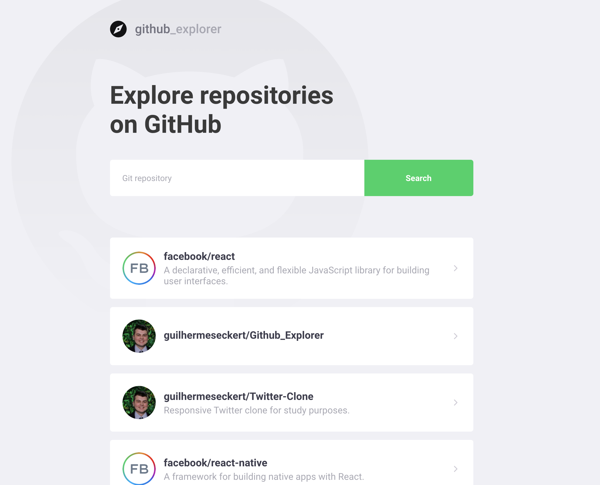

# **Git Explorer**


<p align="center">
  
</p>

<p align="center">
  
  
</p>

---

<h2 align="center">
	 🚀 Responsive Git Explorer for study purposes. 🚀

   [Demonstration here](https://twitter-clone-guilherme-509609.netlify.app/)
</h2>


---

 <p align="center">
  
</p>


</div>

<h4 align="center">
	🚧   🚀 Under construction ...  🚧
</h4>


## 🛠 Technology

The following tools were used in the construction of the project:

- [Node.js](https://nodejs.org/en/)
- [React](https://pt-br.reactjs.org/)
- [TypeScript](https://www.typescriptlang.org/)


## Features

- [x] Serach Repositories


### Prerequisites

Before you begin, you will need to have the following tools installed on your computer:

 - [Git](https://git-scm.com)
 - [Node.js](https://nodejs.org/en/)

In addition, it is good to have an editor to work with the code like

 - [VSCode](https://code.visualstudio.com/)


## Project


#### Dependencies


- Styled-components
- React-router-dom
- React-icons
- Polished
- Axios


### 🎲 Running the the project

``` bash
# Clone this repository
$ git clone https://github.com/guilhermeseckert/Github_Explorer.git

# Access the project folder in the / cmd terminal
$ cd Github_Explorer

# Install the dependencies
$ yarn

# Run the application in development mode
$ yarn start

```


---
Made with by Guilherme S.Eckert :wave: [Get in touch!](https://www.linkedin.com/in/guilherme-eckert/)


